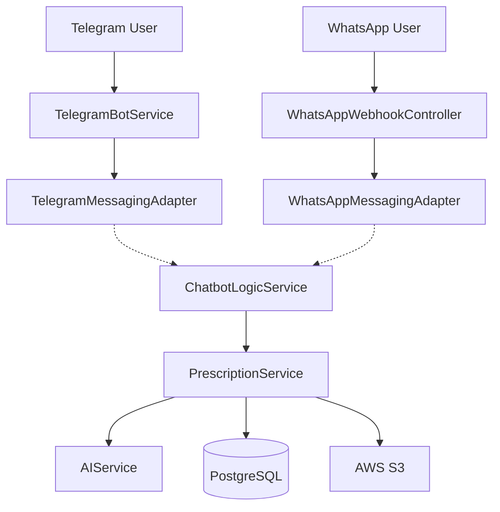
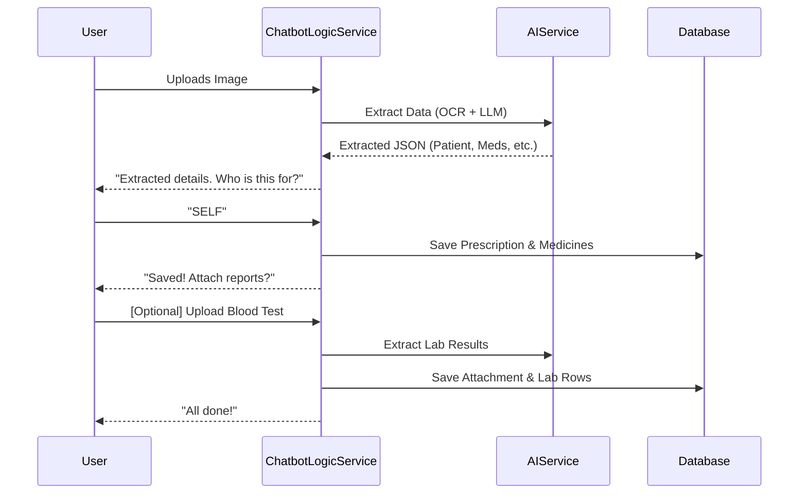
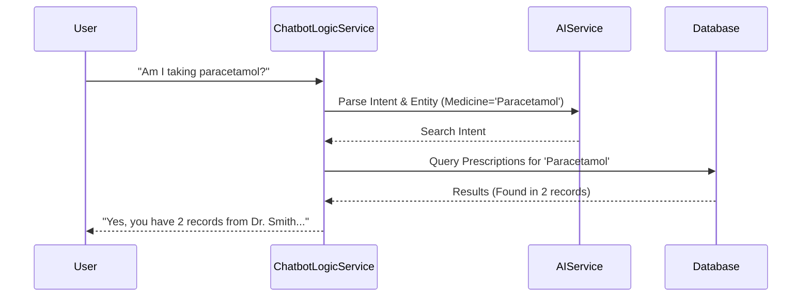
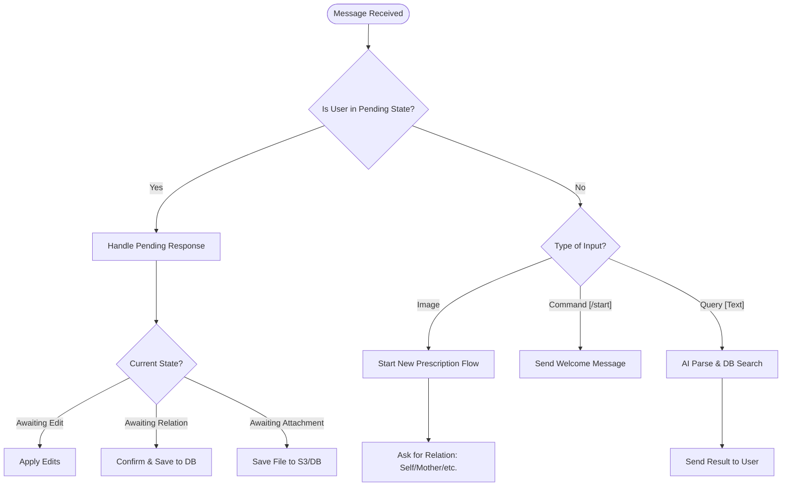

# 💊 Pharmacy Assistant Bot

An AI-powered medical prescription management system that works on **Telegram** and **WhatsApp**. It helps users digitize their medical records, track medications, and manage health records for their entire family using advanced AI extraction.

---

## 🏗 System Architecture

The project uses the **Adapter Pattern** to keep the core logic independent of the messaging platform.



---

## 🚀 What this Project Does

1.  **AI Prescription Extraction**: Upload a photo of a handwritten or printed prescription. The bot automatically extracts:
    *   Patient Name
    *   Doctor & Hospital Name
    *   Visit Date
    *   List of Medicines (Name, Dosage, Frequency, Duration)
2.  **Multi-Platform Support**: Seamlessly switch between WhatsApp and Telegram. The "Brain" (Logic Service) is shared across both.
3.  **Family Management**: Organize records by family member (Self, Mother, Father, etc.).
4.  **Diagnostic Report Sorting**: Attach blood tests, X-rays, or bills to a specific prescription record.
5.  **Natural Language Queries**: Ask the bot questions like:
    *   *"Show my prescriptions"*
    *   *"What was the dose of paracetamol I took last month?"*
    *   *"Am I taking any medicines from Dr. Smith?"*
    *   *"Give me a health summary for my Mother"*
6.  **AI Health Insights**: Get an AI-generated analysis of medication history and health trends.

---

## 🛠 Tech Stack

*   **Backend**: Java 21, Spring Boot 3.3.4
*   **AI**: Spring AI (OpenAI/Gemini Protocol), Gemini 1.5 Flash
*   **Database**: PostgreSQL (Persistence), AWS S3 (Media Storage)
*   **Messaging**: Telegram Bot SDK, Meta WhatsApp Business API

---

## 🔄 User Flows

### 1. Prescription Processing Flow (Happy Path)
This flow describes how a user uploads and confirms a prescription.



### 2. Natural Language Query Flow
How the bot answers questions about your history.



### 3. Chatbot Logic Flowchart
This chart shows how the `ChatbotLogicService` (the Brain) decides what to do based on various triggers.



---

## ⚙️ Setup & Configuration

### Environment Variables

Ensure the following variables are set in your environment or `application.yml`:

| Variable | Description |
| :--- | :--- |
| `SPRING_DATASOURCE_URL` | PostgreSQL connection URL |
| `API_KEY` | Google AI (Gemini) API Key |
| `TELEGRAM_BOT_TOKEN` | Token from @BotFather |
| `WHATSAPP_ACCESS_TOKEN` | Meta Graph API Permanent Token |
| `WHATSAPP_PHONE_NUMBER_ID`| Meta Phone Number ID |
| `WHATSAPP_VERIFY_TOKEN` | Custom token for Webhook verification |
| `AWS_ACCESS_KEY_ID` | AWS Credentials for S3 |
| `AWS_SECRET_ACCESS_KEY` | AWS Credentials for S3 |

### Build & Run

```bash
# Compile with Java 21
JAVA_HOME=/path/to/java21 mvn clean compile

# Run the app
mvn spring-boot:run
```

---

## 🔄 Happy Path Flows

### 1. Telegram Flow
1.  **Greet**: Send `/start`
2.  **Upload**: Send a photo of a prescription.
3.  **Confirm**: Bot shows extracted details. Reply `SELF`, `MOTHER`, etc.
4.  **Attach**: Bot asks if you want to attach reports. Click buttons or send files.
5.  **Finish**: Reply `DONE`.

### 2. WhatsApp Flow
1.  **Greet**: Send "Hi" or "Start"
2.  **Upload**: Send an image of a prescription.
3.  **Confirm**: Bot shows details. Reply with text: `SELF`, `MOTHER`, `FATHER`.
4.  **Attach**: Bot sends interactive buttons. Click a button (e.g., "Blood Test") and upload the file.
5.  **Finish**: Click "No, I'm done".

---

## 🧪 Testing with cURL

### Webhook Verification (WhatsApp)
Meta will ping this when you first set up the webhook.
```bash
curl -X GET "http://localhost:8080/api/whatsapp/webhook?hub.mode=subscribe&hub.verify_token=YOUR_VERIFY_TOKEN&hub.challenge=12345"
```

### Simulating a WhatsApp Text Message
```bash
curl -X POST http://localhost:8080/api/whatsapp/webhook \
-H "Content-Type: application/json" \
-d '{
  "object": "whatsapp_business_account",
  "entry": [{
    "id": "123",
    "changes": [{
      "value": {
        "messaging_product": "whatsapp",
        "messages": [{
          "from": "919876543210",
          "id": "msg_001",
          "timestamp": "1611111111",
          "type": "text",
          "text": { "body": "Show my prescriptions" }
        }]
      },
      "field": "messages"
    }]
  }]
}'
```

---

## 📂 Project Structure

*   `ChatbotLogicService.java`: The core "brain" processing all incoming events.
*   `PrescriptionService.java`: Handles DB logic, AI extraction, and query parsing.
*   `AIService.java`: Interfaces with Gemini/OpenAI for vision and NLP tasks.
*   `MessagingPlatformAdapter.java`: Interface to decouple logic from Telegram/WhatsApp APIs.
*   `WhatsAppMessagingAdapter.java`: Handles Meta Graph API communication.
*   `TelegramBotService.java`: Handles Long Polling for Telegram.
*   `S3Service.java`: Manages file uploads to AWS S3.

---

---

## 🔮 Future Enhancements

We are constantly looking to improve the Pharmacy Assistant. Future plans include:

*   **⏰ Medication Reminders**: Automatic notifications for dose timings based on extracted prescription data.
*   **🌍 Multilingual Support**: OCR and NLP support for regional languages (e.g., Hindi, Spanish, Arabic).
*   **📈 Health Dashboards**: A secure web interface to visualize lab result trends (sugar, cholesterol, etc.).
*   **🎙️ Voice Queries**: Send a voice note to ask about your medication history.
*   **📄 Multi-page Document Support**: Enhanced logic to merge multi-page PDF prescriptions or reports.
*   **🏥 Provider Integration**: One-click sharing of specific reports with your doctor or insurance provider.

---

⚠️ **Note**: This system is designed for Java 21. If using Maven, ensure your `JAVA_HOME` points to a Java 21 JDK.
